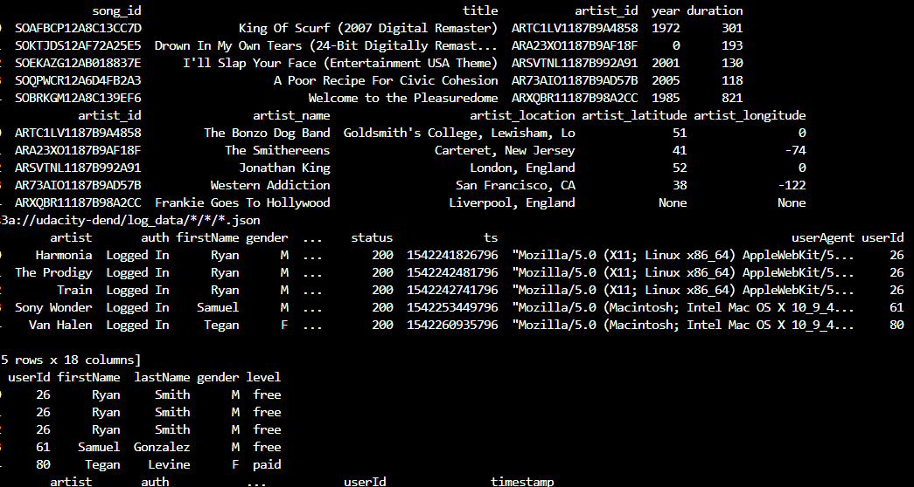

<h1>Introduction</h1>
<h3>
A music streaming startup, Sparkify, has grown their user base and song database even more and want to move their data warehouse to a data lake. Their data resides in S3, in a directory of JSON logs on user activity on the app, as well as a directory with JSON metadata on the songs in their app.</h3>
<h3>An ETL pipeline is built that extracts their data from S3, processes them using Spark, and loads the data back into S3 as a set of dimensional tables. This will allow their analytics team to continue finding insights in what songs their users are listening to.</h3>

The fact table <strong><em>'songplays'</em></strong> and dimension tables schema <strong><em>'users','songs','artists' and 'time'</em></strong> are created in etl.py 
The log and song data is loaded from s3 into song and log tables
The final table <strong><em>'songplays'</em></strong> fetches the song and artist information from song and log table. The other dimension tables 'user','songs','artists' and 'time' data is also inserted either from song or log tables 
Perform following steps to get data into the tables  
<ol>
<li>Mention the appropriate AWS credentials in the dwh.cfg file</li>
<li>Define the schema, load data from s3 and insert them in final tables in etl.py</li>
<li>python etl.py</li>
    
This python file will load the staging tables and insert records in final tables and save them parquet files for analysis

</ol>
<strong>The below final table 'songplays' have the songs and user activity ready for the Sparkify analytical team displayed as below</strong>

<strong>The below final User Table has the user details loaded from the staging events</strong>

 
